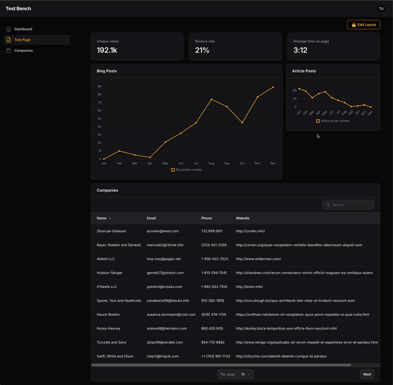

# Filament Layout Manager

[](https://packagist.org/packages/asosick/filament-layout-manager)
[](https://github.com/asosick/filament-layout-manager/actions?query=workflow%3Arun-tests+branch%3Amain)
[](https://packagist.org/packages/asosick/filament-layout-manager)

### Allow users to create & customize their own FilamentPHP pages composed of Livewire components
### Demo


## Table of Contents

- [Installation](#installation)
- [Usage](#usage)
    - [Generate a new page](#1-generate-a-new-page)
    - [Extend your page from LayoutManagerPage](#2-extend-your-page-from-layoutmanagerpage)
    - [Remove auto-generated $view property](#3-remove-auto-generated-view-property)
    - [Define your components](#4-define-your-components)
    - [Passing Widget Data](#passing-widget-data)
    - [Renaming Selection Options](#renaming-selection-options)
- [Multiple Layouts](#multiple-layouts)
- [Customization](#customization)
    - [Extend LayoutManager](#2-extend-layoutmanager)
    - [Update Config](#3-update-config)
- [Saving Layouts to a Database](#saving-layouts-to-a-database)
- [Adding Header Actions](#adding-header-actions)
- [Wrapping in a FilamentPHP page](#optional-wrapping-in-a-filamentphp-page)
- [Child Component Data Stores](#child-component-data-stores)
    - [Why is this useful?](#why-is-this-useful)
    - [Event Hook](#event-hook)
    - [Updating the component's store](#updating-the-components-store)
    - [Using the store](#using-the-store)
    - [Customizing](#customizing)
- [Changelog](#changelog)
- [Contributing](#contributing)
- [Security Vulnerabilities](#security-vulnerabilities)
- [Credits](#credits)
- [License](#license)


## Installation

You can install the package via composer:

```bash
composer require asosick/filament-layout-manager
```

You can publish the config file with:

```bash
php artisan vendor:publish --tag="filament-layout-manager-config"
```

Optionally, you can publish the views using

```bash
php artisan vendor:publish --tag="filament-layout-manager-views"
```

Optionally, you can publish the translation files using
```bash
php artisan vendor:publish --tag="filament-layout-manager-translations"
```

## Usage
The easiest way to use Filament Layout Manager is by creating a new page.

### 1. Generate a new page
```bash
# Replace TestPage with your new page's name
php artisan make:filament-page TestPage
```

### 2. Extend your page from `LayoutManagerPage`

You custom page needs to extend from `use Asosick\FilamentLayoutManager\Pages\LayoutManagerPage;`

```php
use Asosick\FilamentLayoutManager\Pages\LayoutManagerPage;
class TestPage extends LayoutManagerPage {}
```

### 3. Remove auto-generated $view property
To ensure to correct view is rendered, please delete the autogenerated view property in your new Page class. The view to be used is defined in `LayoutManagerPage` and this property overrides it.
```php
use Asosick\FilamentLayoutManager\Pages\LayoutManagerPage;
class TestPage extends LayoutManagerPage
{
 //    protected static string $view = 'filament.pages.custom-page'; <- DELETE OR COMMENT THIS
}
```


### 4. Define your components

You can now define the livewire components you'd like users to be able to add to this new page using the `getComponents()` method:
```php
class TestPage extends LayoutManagerPage
{
    protected function getComponents(): array
    {
        // Replace with your chosen components
        return [
            LivewireComponent::class,
            CompaniesWidget::class,
            BlogPostsChart::class,
        ];
    }
}
```
You can now visit your page, unlock your layout, and begin reorganizing.

### Passing Widget Data
Similar to a traditional filament page, you are able to pass data directly to your widgets. (Support for passing data to custom components coming soon...)

***NOTE: Data passed to this widget will be applied to all its instances. For component specific data, see section below on component data stores***

```php
class TestPage extends LayoutManagerPage
{
    protected function getComponents(): array
    {
        return [
            CompaniesWidget::make([
                'company' => 'Apple'
            ]),
        ];
    }
}
```
This passes your data `['company'=>'Apple']` to your widget in a `data` property. You can access that in your `mount()` function or via a direct property like any Livewire component.
```php
class CompaniesWidget extends BaseWidget
{
    public array $data;
    public function mount(array $data){
        $this->data = $data;
    }
//... other methods & properties
}
```

### Renaming Selection Options
The names associated with your selected components can be changed by overriding the `getComponentSelectOptions` method in your custom page. Be sure to order the array you provided to match the order of the components you provided

```php
class TestPage extends LayoutManagerPage
{
    protected function getComponents(): array
    {
        return [
            CompaniesWidget::class, //Default select option is `CompaniesWidget`
        ];
    }

    protected function getComponentSelectOptions(): array
    {
        return ['My Company Widget'];
    }
}
```

## Multiple Layouts
Users are able to define multiple layouts they can switch between.

Each layout is mapped to a keybinding based on its number:
* `command+1 | ctrl+1` => layout 1
* `command+2 | ctrl+2` => layout 2 
* so forth...

Change the default number of views using the `getLayoutCount()` function in your page class or update the configuration file.

## Customization
Filament Layout Manager wraps your Livewire components inside a customizable class, allowing users to modify them.

This wrapper class is different from your Page class or its Blade view. The Page class renders the wrapper component, while the wrapper enables user manipulation of Livewire components.

The wrapper class that must be extended to enable customization is `Asosick\FilamentLayoutManager\Http\Livewire\LayoutManager.php`

In order to customize say the colour of one of the header buttons, first:

#### 1) Publish the configuration file
```bash
php artisan vendor:publish --tag="filament-layout-manager-config"
```
#### 2) Extend LayoutManager
Create a new class in your application called (for example) `App\Livewire\CustomLayoutManager.php` 
and extend that class off of `Asosick\FilamentLayoutManager\Http\Livewire\LayoutManager.php`

```php
namespace App\Livewire;
use Asosick\FilamentLayoutManager\Http\Livewire\LayoutManager;
use Filament\Actions\Action;

class CustomLayoutManager extends LayoutManager
{
    /* Example of changing the colour of the add button to red */
    public function addAction(): Action
    {
        return parent::addAction()->color('danger');
    }
}
```
#### 3) Update config
Update your configuration to point to your new custom class.
```php
// newly published config file
return [
    'layout_manager' => \App\Livewire\CustomLayoutManager::class,
    // Other settings 
    // ...
];
```

I recommend exploring the code in `LayoutManager` when digging into customization. You'll want to ensure you're still calling the require methods on actions you edit.


### Saving Layouts to a Database
By default, layouts are saved in the user's session and are not persisted

In order to save your user's layout to a database (or file, etc.), you'll need to
1. Override `LayoutManager` as shown above
2. Implement a new `save()` function to persist the layout
3. Implement a new `load()` function to load the layout

**Where a user's layout is saved in your database and how that is managed is your concern.**

There needs to be somewhere to store this information. Perhaps a json column on your user's table called `settings` for example. You'll need to create a column if it doesn't exist in your DB.

#### Example
Assumes a `settings` json column on your user's model where settings can be stored.

```php
namespace App\Livewire;

use Asosick\FilamentLayoutManager\Http\Livewire\LayoutManager;
use Illuminate\Support\Arr;

class CustomLayoutManager extends LayoutManager
{
    public function save(): void
    {
        $user = auth()->user();
        $user->settings = [
            'container' => $this->container
        ];
        $user->save();
    }

    public function load(): void
    {
        $user = auth()->user();
        $this->container = Arr::get(
            json_decode($user->settings, true),
            'container',
            []
        );
    }
}
```

### Adding Header Actions
Header actions can be add to the right of the 'Lock' button by overriding the `getHeaderActions()` method in your custom LayoutManager (*NOT your custom page*).

Example:
```php
namespace App\Livewire;

use Asosick\FilamentLayoutManager\Http\Livewire\LayoutManager;
use Filament\Actions\Action;
use Illuminate\Support\Facades\Log;

class CustomLayoutManager extends LayoutManager
{
    public function getHeaderActions(): array
    {
        return [
            Action::make('hello')
                ->action(fn () => Log::info('hello world!')),
            Action::make('goodbye')
                ->action(fn () => Log::info('goodbye world!')),
        ];
    }
}
```


#### (Optional) Wrapping in a FilamentPHP page
By default, the LayoutManagerPage is not rendered with the traditional FilamentPHP page tags. If, for some reason, you need everything wrapped in a FilamentPHP page, you can enable that as so:

```php
namespace App\Filament\Pages;
use Asosick\FilamentLayoutManager\Pages\LayoutManagerPage;
use Filament\Actions\Action;

class TestPage extends LayoutManagerPage
{
    /* Wrap the LayoutManager component in a traditional filament page */
    public function shouldWrapInFilamentPage(): bool
    {
        return true;
    }

    /* Can now use existing filament header actions */
    protected function getHeaderActions(): array
    {
        return [
            Action::make('my-header-action')
        ];
    }
}
```

or
```php
/* In filament-layout-manage.php config file */
'wrap_in_filament_page' => true,
```
You may need to override some filament css hooks to get the spacing right for what you need.

## Child Component Data Stores
Components can save data about themselves (like table filters or form values) and restore it when the user returns to the page.

#### Why is this useful?
For example, in my application, I wanted table widgets to remember the filters users applied across sessions.

Filament does provide a `persistToSession()` option for tables, but this does not work for multiple table widgets or across sessions.

### Event Hook
I've provided a livewire event for you to utilize for this purpose.

Each livewire component rendered through your layout manager is passed a value called `container_key` used to keep track of its data. 
Component specific data is passed via the `store` property.

Each livewire component can dispatch an event to the `LayoutManager` class to update it's `store` which is saved alongside your layout data.

### Getting the component key and store

Define the container_key and store properties in your widget or component class
```php
/* 
Provide the following as part of your child component (like a widget class), to get the id and your data (in store).
*/
public string $container_key;
public array $store;

public function mount(string $container_key, array $store){
    $this->container_key = $container_key;
    $this->store = $store;
}
```

### Updating the component's store
Execute the following anywhere in your child-component (like a table widget), while replacing the `store: []` with actual data.
```php
$this->dispatch('component-store-update',
    id: $this->container_key,
    store: []
);
```
(For example, I dispatch the above in my table widget where store is all the current table filters)


### Using the store
Your components `store` property is passed just like any livewire property on reloads of your layout.

### Customizing
This `component-store-update` event method is present in `LayoutManager` meaning if you want to change it's behaviour, you are free to do so in your custom layout manager.

How to create a custom layout manager is detail above in this README.

[//]: # (This is the contents of the published config file:)

[//]: # ()
[//]: # (```php)

[//]: # (return [)

[//]: # (];)

[//]: # (```)
[//]: # ()
[//]: # (## Usage)

[//]: # ()
[//]: # (```php)

[//]: # ($reorderWidgets = new Asosick\ReorderWidgets&#40;&#41;;)

[//]: # (echo $reorderWidgets->echoPhrase&#40;'Hello, Asosick!'&#41;;)

[//]: # (```)

[//]: # ()
[//]: # (## Testing)

[//]: # ()
[//]: # (```bash)

[//]: # (composer test)

[//]: # (```)

## Changelog

Please see [CHANGELOG](CHANGELOG.md) for more information on what has changed recently.

## Contributing

Please see [CONTRIBUTING](.github/CONTRIBUTING.md) for details. All contributors welcome - don't be shy :)

## Security Vulnerabilities

Please review [our security policy](../../security/policy) on how to report security vulnerabilities.

## Credits

- [August](https://github.com/asosick)
- [All Contributors](../../contributors)

## License

The MIT License (MIT). Please see [License File](LICENSE.md) for more information.
